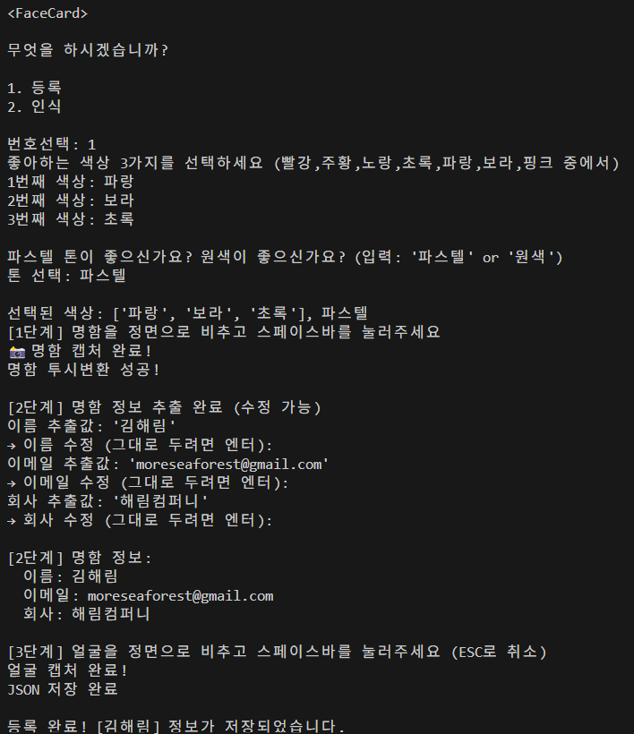

# FaceCard
**KeyWords:** Face Recognition, Business Card OCR, Real-Time Personal Identification, Data Integration  

**FaceCard** is a system that integrates face recognition technology (based on OpenCV) with business card OCR (Optical Character Recognition), allowing users to register both facial images and business card data.  
  
Once registered, the system can **identify individuals in real-time** using only facial recognition, retrieving their associated business card information automatically.

This project was developed as a **team assignment for a Computer Vision course**, inspired by the question:  
> *“What if we could identify someone and access their business card info just by recognizing their face?”*

## Key Features

- User-defined color tagging for individuals
- Business card image registration with automatic text extraction (OCR)
- Face image registration 
- Real-time face recognition and information display
- Optionally, background music is played during program execution using Pygame.

## Preview
<p>
  
  
</p>
  
 
## Tech Stack
- **OpenCV** – Face detection and real-time camera processing  
- **Pytesseract** – OCR to extract text from business card images  
- **PIL**, **Numpy** – Image processing and numerical computation  
- **Re (Regular Expressions)** – Text filtering and cleaning  
- **Json** – User data storage  
- **Pygame** – Background music playback during program execution

## How It Works
<p>
  
</p>

## Project Structure
```plaintext
project/
├── main.py                 # Entry point – launches the app
├── register.py             # Face + card image registration
├── recognition.py          # Real-time face recognition logic
│
├── data/                   # User data
│   ├── people.json         # Face + card data store
│   ├── card/               # Saved card images
│   └── faces/              # Saved face images
│
├── project_mp3/            # (Optional) MP3 files for audio output
├── result/                 # # Folder created for README screenshots (not required to run)
│
├── facecard_pipline.png    # System architecture diagram (used in README only, not required for execution)
├── requirements.txt        # Python dependencies list
└── README.md               # Project overview and usage guide
```

## How to Run
### 1. Create a virtual environment (optional but recommended)
If you're using **conda**:

    conda create -n myenv python=3.9
    conda activate myenv

### 2. Install dependencies  
   - Using pip:  
   ```pip install opencv-python pytesseract numpy pillow pygame```
     
   - Or from requirements.txt::  
   ```pip install -r requirements.txt```

 
 ### 3. Install Tesseract-OCR engine
  - Download and install from:  
      https://github.com/UB-Mannheim/tesseract/wiki

  - After installation:  
         - Windows: Add Tesseract install path to your system ```PATH```  
         - macOS: Can install via Homebrew: 
             ``` brew install tesseract ```

### 4. Run the Program

    python main.py

## License

This project was created for educational purposes as part of a university computer vision course.  
The source code is **not licensed for commercial use**.

It includes several open-source libraries such as **OpenCV**, **Pytesseract**, **Pillow**, and **Pygame**.  
Please refer to each library’s license for details.
  


## Limitations & Challenges

As a university-level project, we focused on core OpenCV functionalities and faced several technical challenges:

**OCR Accuracy**: Text extraction from business cards with complex layouts, fonts, or colors struggled with accuracy. Improving this would require advanced image preprocessing or a deep-learning-based text detection model.

**Face Recognition Angles**: The system was less effective at detecting non-frontal faces (i.e., at an angle). This could be enhanced by implementing face alignment techniques or training the model on a more diverse dataset with multi-angle face data.


