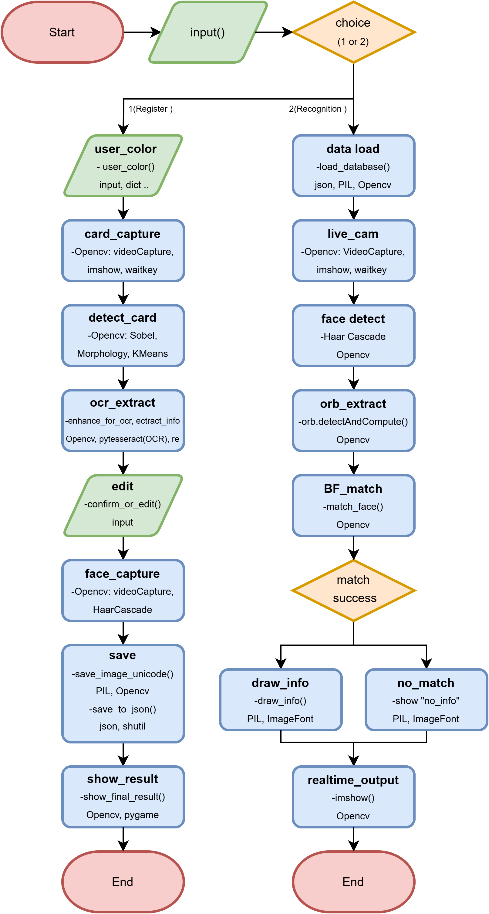

# FaceCard
**KeyWords:** Face Recognition, Business Card OCR, Real-Time Personal Identification, Data Integration  

**FaceCard** is a system that integrates face recognition technology (based on OpenCV) with business card OCR (Optical Character Recognition), allowing users to register both facial images and business card data.  
  
Once registered, the system can **identify individuals in real-time** using only facial recognition, retrieving their associated business card information automatically.

This project was developed as a **team assignment for a Computer Vision course**, inspired by the question:  
> *“What if we could identify someone and access their business card info just by recognizing their face?”*

# Key Features

- User-defined color tagging for individuals
- Business card image registration with automatic text extraction (OCR)
- Face image registration (encoding and storage)
- Real-time face recognition and information display  

# Preview

  
 
# Tech Stack
- **OpenCV** – Face detection and real-time camera processing  
- **Pytesseract** – OCR to extract text from business card images  
- **PIL**, **Numpy** – Image processing and numerical computation  
- **Re (Regular Expressions)** – Text filtering and cleaning  
- **Json** – User data storage  
- **Pygame** – UI rendering for displaying identified information

# How It Works

  

# How to Run

